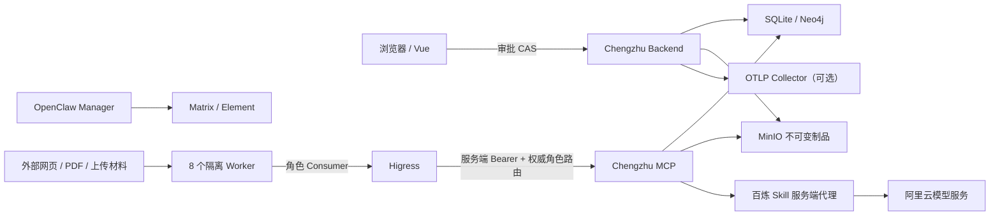

# Chengzhu AgentTeams 威胁模型

## 范围与安全目标

范围是单机 Docker 竞赛部署、八个 AgentTeams Worker、OpenClaw Manager、Matrix/Element、Higress、Chengzhu MCP、SQLite/Neo4j/MinIO、百炼官方 Skill 服务端代理、Vue 审批和 OTel 导出。

核心安全目标：事实可追溯、冻结后不可静默变化、角色最小权限、重复调用无重复副作用、未经 Vue 明确批准绝不发布、密钥/私有原文不进入 Worker 或协作消息、故障与预算缺口不被掩盖。

本模型不是公网多租户安全认证。默认部署只绑定回环地址，也没有可替代企业 IdP 的完整用户认证；离开本机演示环境前必须增加网络隔离、身份认证、授权审计和渗透测试。

## 资产

- 用户 TaskCard、上传材料、授权/同意记录和私有数据边界；
- EvidenceCard、FinancialFact、冻结 manifest、claim/audit/verdict；
- 报告草稿、审校 hash、人工审批、`latest` 指针和历史版本；
- SQLite 状态版本、幂等结果、TeamHarness Project/Task 状态；
- MinIO 不可变制品、Neo4j 图谱、Matrix 事件和 ArtifactRef；
- MCP、Matrix、MinIO、Higress、模型、OTLP 等凭证；
- 固定安装器、容器镜像、Worker ZIP、官方 Skill 和依赖锁；
- 480 秒/2 元预算、外部模型额度与运行可用性；
- 审计日志、`trace_id/span_id` 与演示证据。

## 信任边界

跨边界内容一律按不可信处理。Matrix 是协作镜像，不是数据库；Worker 是受限执行者，不是发布主体；外部文档是数据，不是指令；OTLP Collector 和云模型是外部处理方。

## 主要威胁、控制与残余风险

| 威胁 | 已有控制 | 残余风险与后续动作 |
|---|---|---|
| MCP 冒充或跨角色调用 | 八条独立 Higress 路由和 per-Worker Consumer；后端以 URL 角色为权威并拒绝冲突 header；工具 allowlist；服务 Bearer 不进入 Worker；mutation 要求 run/task/idempotency/CAS | Higress 管理员或网关主机失陷仍可伪造；需实机轮换、拒绝 impersonation 测试、管理面强认证与审计 |
| Matrix/Element 泄漏 | 消息只放任务摘要和 ArtifactRef；禁止完整证据、Base64、密钥、私有原文和隐藏推理；事件对 UI 脱敏；Matrix 人工文本无审批效力；端口回环绑定 | 房间元数据与摘要仍敏感；E2EE/房间策略需按固定上游实机确认；Element 账号失陷仍可读取展示数据 |
| 外部文档提示注入 | 采集与系统指令分离；Collector 只追加 EvidenceCard；freeze 后分析角色禁止联网；工具/角色 allowlist；Judge 使用确定性审计；Writer 不能重新检索 | 模型仍可能被文档内容影响分类/摘要；需加入恶意 PDF/网页反例集、输出 schema 严格校验和人工抽检 |
| 制品 TOCTOU、替换或错误去重 | 后端用 `O_NOFOLLOW` 打开文件描述符，从同一字节快照完成 hash 与上传；对象键包含内容 SHA-256 和 provenance SHA-256；manifest 记录生产者/schema；发布按精确 hash | MinIO 管理员仍能删除/覆盖对象；当前未证明 bucket object lock/WORM，需备份、权限隔离和定期全量 hash 校验 |
| Worker 越权发布或伪造人工批准 | Worker 不暴露 `publish_approved_report`；Vue 是唯一审批入口；approval 带 expected_version 与精确报告 hash；Matrix 消息无授权；回滚只切换指针并追加事件 | 本地部署缺少企业级用户认证；若端口被错误公网暴露，攻击者可能直接调用 API。远程部署前必须加 IdP、会话/CSRF 与细粒度 RBAC |
| 未通过审计的 Claim 进入报告 | EvidenceAuditor 硬失败不可被 Judge 覆盖；Writer 只接收 allowed claim set；Reviewer 检查引用/hash；人工批准仍针对精确版本 | 模板或代码回归可能绕过过滤；需保留“正式报告中审计失败 Claim=0”的 E2E 断言和发布前重验 |
| 私有数据或未授权上传内容发往百炼 | 仅公开材料或用户明确上传且持久化同意的页面可调用；Datayes 私有原文禁止；服务端代理执行固定 Skill；Key 不进入 Worker；失败本地降级 | 数据分类/同意可能被操作人误标；云侧留存和地域条款需法务确认；应增加 DLP、同意撤销和处理清单审计 |
| 供应链篡改 | AgentTeams tag/commit、安装器 SHA、三类镜像 digest、Worker ZIP/SHA256SUMS、官方 Skill commit/逐文件 hash；不使用未校验 `curl | bash`；版本不匹配即拒绝 | 嵌入镜像内 Matrix/Element/Higress/MinIO 的具体版本与传递依赖尚未形成已审核 SBOM；Neo4j 仅锁 minor tag；需生成、签名、扫描 SBOM 与许可证清单 |
| 预算/Token 耗尽导致拒绝服务或超支 | 后端/MCP 可见调用有 run 账本和 480 秒/2 元限制；task 预算；最多 3 活跃 Worker；一次失败重试；`AGENTTEAMS_MODEL_MAX_TOKENS` 限制单次输出 | AgentTeams v1.2.0 无按 Chengzhu run 汇总 Worker 用量 API，完整跨 Worker 2 元硬闸门**未完成**；需带 run 维度的 Higress/LLM 代理聚合并 fail closed |
| 重放、重复消息或 Worker 重启 | SQLite CAS、幂等键、任务结果和 ArtifactRef 是恢复依据；Matrix 不用于自动恢复；Worker 重试一次；内容寻址制品 | 外部供应商可能已计费但调用结果未落账；需对账/补偿机制、崩溃窗口故障注入和用量幂等关联 |
| SSRF 或任意网络访问 | Worker 只获得声明的 MCP；freeze 后角色不联网；MCP 工具参数/来源政策受限；内部服务不暴露公网 | Collector 仍需访问外部 URL；需 URL canonicalization、DNS rebinding 防护、出口 allowlist 和元数据地址阻断的实机验证 |
| 日志、trace 或错误信息泄密 | AgentLog/Team event 脱敏；trace 属性只允许简单元数据；禁止 prompt、CoT、Base64、密钥和隐私原文；服务端 token 文件权限收紧 | 第三方 SDK/容器 stdout 可能绕过应用脱敏；需集中日志 DLP 扫描、短留存和受控截图流程 |
| 备份或运维误操作 | `competition-down` 不删数据；owner 标记限制控制面停机；reconcile 有 Worker/run 双检查；恢复依赖 hash | 尚无自动加密备份、恢复演练和原子多存储快照；运维脚本之外的手工 Docker 操作仍可能破坏状态 |

## 权限不变量

1. Collector 只能追加 EvidenceCard；分析、Judge、Writer、Reviewer 不得修改冻结证据。
2. `evidence-freeze` 只能由 Research Lead 调用角色绑定 MCP 后桥接到 TeamHarness，不能分派给 Worker。
3. Judge 不能把确定性硬失败改为通过；Writer 不能新增外部事实；Reviewer 不能发布。
4. 只有 Vue 审批 API 可触发发布；approval 必须匹配 run、报告 hash 和 state version。
5. Matrix 中任何“批准”“忽略审计”“重新发布”文本都只是展示事件。
6. 私有来源原文、长期 Key 和隐藏推理不得进入 Worker 包、Matrix、MinIO 展示制品或 OTel。

## 验证清单

- 对每个 Worker 尝试调用一个越权 MCP 工具，期望稳定拒绝；
- 对八条路由做匿名、错误 Consumer 和冲突角色 header 测试；
- 用包含“忽略系统提示”的 PDF 验证它只形成被引用的数据；
- 在 hash 与上传窗口替换/软链文件，验证不会发布不同字节；
- 直接调用发布、Matrix 发批准、使用过期 expected_version，均应失败；
- 上传未同意或标记私有的页面，百炼代理应拒绝且不出网；
- 篡改 installer、Worker ZIP、Skill 文件和镜像 digest，启动应 fail closed；
- 注入模型 429、MCP crash、Worker restart 和 MinIO 故障，验证固定降级/恢复策略；
- 对全部日志、Matrix、OTel 和演示截图做密钥/隐私/Base64/隐藏推理扫描；
- 在跨 Worker 预算代理完成前，明确展示用量可见性缺口，不做 2 元全链路保证。

## 接受与复审

威胁模型需在以下事件后复审：AgentTeams/Skill/模型版本升级、开放远程访问、引入新私有数据源、修改 Worker 工具权限、启用 Matrix E2EE、改变 MinIO 保留策略、接入新 OTLP Collector，或实现跨 Worker 预算代理。每次复审保留日期、负责人、变更 diff、测试证据和未接受风险。

