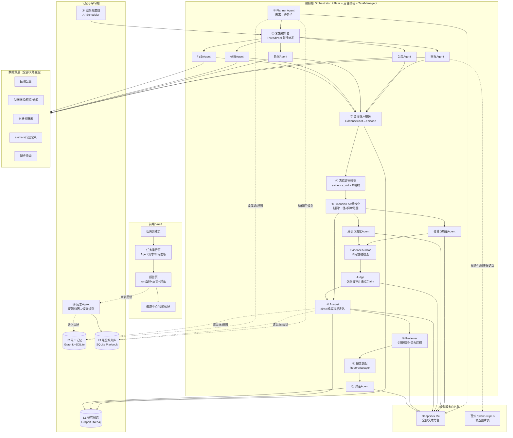

# 02 · 多 Agent 编排架构设计

> 本文档是全项目的总设计图。执行 Agent 必须先通读本文档再开工。
> 设计原则：**最大化继承 MiroFish 的工程骨架**（异步任务+轮询、文本协议 ReAct、图谱记忆、JSONL 过程日志），**整段替换**与投研场景错位的 OASIS 社媒仿真链路，**新增**历史学习层。

---

## 1. MiroFish 编排的解剖结论（改造依据）

MiroFish 后端是 `Flask API + 内存 TaskManager + 后台线程/子进程 + 文件持久化 + 前端 2s 轮询` 的编排模型，管线为：

```
上传+本体(同步) → 图谱构建(异步线程,轮询Task) → 创建Simulation(同步)
→ Prepare人设/配置(异步线程,轮询) → OASIS子进程仿真(文件IPC+actions.jsonl监控)
→ ReportAgent报告(异步线程, 规划chat_json + 章节级文本协议ReAct) → 报告对话(同步简化ReAct)
```

其中真正的"多 Agent"有两层：**编排层 LLM Agent**（OntologyGenerator、ProfileGenerator、ConfigGenerator、ReportAgent——前三个是单轮 JSON 生成器，只有 ReportAgent 是完整 ReAct）和**仿真层 OASIS 社交 Agent 群**。

**对投研场景的判断**：
- 值得继承的精华：① 阶段化异步管线与状态轮询协议；② 时序图谱作为所有 Agent 的共享记忆总线；③ ReportAgent 的"规划大纲 → 每章节 ReAct 工具循环（强制最少 3 次取证、最多 5 次、Final Answer 终止）→ 装配"范式；④ `agent_log.jsonl` 全程留痕带来的过程可观测性；⑤ 工具以字典注册 + `<tool_call>` XML 文本协议解析（不依赖模型原生 function calling，换模型不换代码）。
- 主管线替换：OASIS 仿真全家桶不适合承担"信息整理"主流程——整理需要的是**对真实数据源的并行采集**，因此主管线把"成千上万个仿真 Agent"替换为"5 类专家采集 Agent"。但 OASIS 链路本身（profile 生成、子进程运行、interview IPC）**整体移植保留为"情景推演"支线**（10 文档）：信息整理完成后，以研究图谱为种子世界推演假设情景——这是研究员"如果发生 X 会怎样"的高阶工作，也是本产品区别于纯信息聚合工具的核心亮点。
- MiroFish 缺失、我们新增：任务卡确认的人机交互点、审校 Agent、历史学习层（反馈→反思→规则库）、追踪订阅调度。

## 2. 成竹 总体架构



## 3. 端到端管线（阶段定义，对齐 MiroFish 的衔接方式）

| # | 阶段 | 执行体 | 同步/异步 | 输入 | 输出 | MiroFish 对应物 |
|---|------|--------|----------|------|------|----------------|
| 0 | 需求解析 | Planner Agent（单轮 chat_json + 记忆注入） | 同步（<10s） | 自然语言需求、可选上传文件、用户记忆 | TaskCard（草案） | OntologyGenerator 的同步生成模式 |
| 0b | 任务卡确认 | 用户 | 人机交互 | TaskCard 草案 + `analysis_mode` | 冻结 TaskCard + 新 `run_id` | **新增**（MiroFish 无确认环节） |
| 1 | 并行采集 | 采集编排器 + 5 类采集 Agent | 异步线程，Task 轮询 | 本次 run 的 TaskCard | EvidenceCard 集合 | 替换 OASIS Prepare+仿真 |
| 2 | 图谱摄入与冻结 | GraphIngest + EvidenceStore（非 LLM） | 异步/原子发布 | 本次 EvidenceCards | ResearchGraph + 不可变证据索引 | GraphBuilderService + **新增快照** |
| 3 | 财务标准化 | FinancialNormalizer（非 LLM） | 确定性同步 | 财务证据 | `FinancialFact` JSONL + 不可比原因 | **新增** |
| 4a | 直接分析 | Analyst | 异步线程 | 冻结证据 + 标准化事实 | direct 章节草稿 | ReportAgent 规划+ReAct 骨架 |
| 4b | 两轮证据辩论 | 两名 Debate Agent | 固定四次批量 LLM 调用 | 最多四维度 + 冻结证据 | ClaimCard + Challenge | **新增**；summary/compare 可选 |
| 5 | 硬审计与裁决 | EvidenceAuditor + Judge | 确定性检查后一次综合 | Claim/Challenge/FinancialFact | `DebateVerdict` | **新增** |
| 6 | 报告表达与审校 | Analyst + Reviewer | 异步 | direct 草稿或 Verdict | 审定章节 + 审校记录 | ReportAgent + **新增 Reviewer** |
| 7 | 装配交付 | ReportAssembler | 异步收尾 | 审定章节 | report.json/Markdown + 引用/免责声明 | ReportManager.assemble_full_report |
| 8 | 对话/反馈/追踪 | Chat、Reflection、TrackingScheduler | 请求/事件/定时 | 指定 `run_id` 的报告与证据 | 回复、规则、增量简报 | 继承并扩展 |
| 9 | 情景推演（可选支线） | ScenarioAgent + OASIS 仿真 + 推演报告 Agent | 异步（15-25 分钟，独立轮询） | 研究图谱 + 用户假设 | 情景观察报告 + 可采访模拟世界 | OASIS 全链路移植（10 文档） |

### 3.1 任务状态机（ResearchTask，持久化 JSON，模式沿用 MiroFish Project/Task 双层）

```
created → parsing → awaiting_confirm → collecting → ingesting
        → normalizing
        ├─ direct ─────────────────────→ analyzing
        └─ evidence_debate → debating → adjudicating → analyzing
        → reviewing → assembling → completed
任意阶段 → failed（含 error 信息）
已成功生成可读报告但部分能力降级 → completed_partial（报告披露缺失项）
```

- **持久层**：任务主档为 `uploads/tasks/{task_id}/task.json`；每次执行写 `runs/{run_id}/`，确认后的 TaskCard、证据与报告不可被后续 run 覆盖；
- **进度层**：进程内 `TaskManager` 单例（直接复用 MiroFish `app/models/task.py`：pending/processing/completed/failed + progress 0-100 + progress_detail），前端 2s 轮询；
- **辩论进度**：`progress_detail.debate` 只包含回合、角色和 Claim/Challenge/撤回/硬失败计数，不包含 chain-of-thought；
- **终态约束**：没有 `report.json` 时不得标记 `completed_partial`；DeepSeek 辩论失败时，必须用同一冻结快照降级 direct 并在报告披露“辩论未完成”。

### 3.2 并行采集编排（替换 OASIS 的核心设计）

`backend/app/services/collect_orchestrator.py`：

1. 由 TaskCard 决定激活哪些采集 Agent（`info_types` 字段，见 03 文档）；对比类任务对每个 symbol 各派发一轮；
2. `ThreadPoolExecutor(max_workers=COLLECTOR_MAX_PARALLEL)` 并行执行；每个采集 Agent 是"**LLM 制定采集计划（单轮 JSON）→ 顺序执行工具 → LLM 质检筛选**"的三步结构（详见 03 文档），不做长 ReAct（采集动作可预先规划，省 token 且稳定）；
3. 派发前查询 L3 routing 规则与数据源健康度（04 文档 §5），决定首选/降级工具；
4. 每个 Agent 完成即：EvidenceCards 落盘 `uploads/tasks/{id}/evidence/{agent}.jsonl` → 触发 GraphIngest 入图（流水线化，不等全部采集完）→ TaskManager 进度+8%；
5. 单 Agent 超时 180s / 抛异常：记 `collect_failures`，不阻塞其他 Agent；全部失败才置任务 failed；
6. 所有动作写 `agent_log.jsonl`（格式完全沿用 MiroFish ReportLogger 的 action/stage/details 结构，前端复用增量拉取协议）。

### 3.3 分析与审校的流水线

- 分析 Agent 先跑 `plan_outline`（继承 MiroFish：chat_json、temperature 0.3、大纲 2-5 章、失败有默认大纲兜底），大纲模板按 deliverable 类型给出固定骨架（01 文档 §6），LLM 只做小节增删与措辞；
- 每章节 ReAct 循环参数（沿用 MiroFish 经过验证的数值，但接到 env）：`min_tool_calls=2`、`max_tool_calls=ANALYST_MAX_TOOL_CALLS(6)`、`max_iterations=8`、冲突重试 2 次；工具协议原样保留 `<tool_call>{json}</tool_call>` + `Final Answer:`，解析器直接移植 MiroFish `_parse_tool_calls / _strip_fake_tool_results / _is_valid_tool_call`；
- 章节完成 → 立即送 Reviewer（独立线程队列），Reviewer 通过则落盘 `section_XX.md`，不通过则带批注退回分析 Agent 重写（最多 REVIEWER_MAX_ROUNDS=2 轮，仍不过则采纳 Reviewer 的改写稿并在审校记录中标注）；
- 全章节审定后装配：目录 + 正文 + 「信息来源清单」（全部 EvidenceCard 按角标编号列出）+ 「数据完整性说明」（collect_failures）+ 免责声明。

### 3.4 两轮证据辩论与硬审计

1. 稳健与质量 Agent 提出现金流、盈利质量、资产负债和经营稳健性 Claim；成长与变化 Agent 提出增长驱动、业务变化和可持续性 Claim，并挑战前者。
2. 稳健与质量 Agent 回应、修订或撤回；成长与变化 Agent 最终回应。四次调用均批量处理最多四个研究维度，格式/硬校验全局最多两次纠错调用。
3. `EvidenceAuditor` 是确定性代码：验证 evidence/fact UID、数字、单位、币种、期间、累计/单季、合并范围、披露时点和合规词。任一硬失败的 Claim 不得进入 accepted。
4. Judge 只综合审计通过内容为 `DebateVerdict`，固定输出共识事实、证据支持的解释、未决分歧、撤回观点、证据缺口、假设与后续公开事项；不得覆盖 Auditor。
5. 辩论期间不调用采集工具或联网搜索。缺口输出 `EvidenceRequest`，由用户或后续任务补齐；历史 Verdict 仅是待复核线索，不能升级为事实证据。

### 3.5 追踪订阅管线（闭环 B）

- APScheduler（BackgroundScheduler，随 Flask 启动）按订阅 cron 触发；
- 重跑时 TaskCard 不变，采集时间窗 = [上次水位线, now]；GraphIngest 增量写入（05 文档 §2.3）；
- 分析 Agent 使用"追踪简报"大纲，核心工具是图谱时序查询：新增边（created_at 在窗口内）→"本期新增"；失效边（invalid_at 在窗口内）→"变化与更正"；
- 简报存 `uploads/subscriptions/{sub_id}/briefs/{date}.md`，前端追踪中心时间线展示。

## 4. 关键技术决策记录（ADR）

| 决策 | 选择 | 理由（含放弃项） |
|------|------|-----------------|
| 工具调用协议 | 沿用 MiroFish 文本协议（XML tool_call） | 模型无关、日志可读；比赛版不引入原生 Function Calling 或 Streaming |
| 采集 Agent 结构 | 计划→执行→质检 三步，非 ReAct | 采集步骤可预先确定，ReAct 在此只增加成本与不确定性 |
| 并行机制 | 主管线用 ThreadPoolExecutor 线程池；推演支线保留 MiroFish 子进程+文件 IPC | 采集是 IO 密集用线程即可；OASIS 仿真是长驻环境，沿用其成熟的子进程+IPC 模式 |
| 图谱引擎 | 自托管 Graphiti+Neo4j | Zep Cloud 境外+闭源计费；Graphiti 是其开源内核，API 语义对齐，迁移成本最低（05 文档有对照表） |
| 前后端通信 | 保持轮询（2s Task / 增量 agent-log） | 复用 MiroFish 全部前端骨架；放弃 WebSocket（改造成本高，Demo 无必要） |
| 业务数据 | SQLite | 反馈/规则/健康度需要 SQL 聚合查询，MiroFish 纯 JSON 文件不够用；任务主档仍用 JSON 文件保持与 MiroFish 骨架一致 |
| 模型能力分级 | DeepSeek V4 文本 + 百炼 Qwen-VL 视觉 | flash 负责普通文本，pro 非思考负责 Reviewer、pro 思考负责 Debate/Judge；Qwen-VL 仅接收候选图片页，绝不静默接管文本 |
| run 隔离 | 每次确认生成不可变 `run_id` | 支持 direct/debate A/B，对历史证据、反馈与报告做精确归属；根目录只保留 latest 兼容副本 |
| 财务可比性 | Decimal 标准化 + 硬校验 | 期间、累计口径、币种、单位或合并范围不一致时返回“暂无同口径数据”，禁止进入比较和图表 |

### 4.1 模型接入契约

| 能力 | Provider / 模型 | 调用约束 |
|------|-----------------|----------|
| 普通文本 | DeepSeek `deepseek-v4-flash` | Planner、普通 Analyst、报告表达、Chat、Reflection、Scenario；JSON/控制流显式 `thinking=disabled` |
| 高质量审校 | DeepSeek `deepseek-v4-pro` | Reviewer 使用非思考模式 |
| 辩论与裁决 | DeepSeek `deepseek-v4-pro` | `thinking=enabled`、`reasoning_effort=high`；不发送 temperature，不记录 `reasoning_content` |
| PDF 视觉 | 百炼 `qwen3-vl-plus` | 本地文本/表格优先；只对低文本密度或图片/图表候选页发送 OpenAI content array + 内存 Base64 |

- 文本和视觉分别使用 `TEXT_LLM_*`、`VISION_LLM_*`；旧 `LLM_*` 仅作为迁移回退。connect/read timeout 默认 10/180 秒，429、500、503、超时或资源不足最多一次传输重试。
- JSON Prompt 必须包含 JSON 示例；空内容、坏 JSON 或截断仅允许一次等 token 上限再生成。Qwen-VL 失败保留本地解析并标记不完整，禁止静默切换成百炼文本模型。
- 内部 `LLMResult` 只保留 provider、model、finish reason、usage、request ID、延迟和重试数；数据库 `llm_call_log` 不保存 Prompt、Key、图片 Base64 或原始思维链。

### 4.2 run 产物与公共读取接口

```text
uploads/tasks/{task_id}/runs/{run_id}/
  run.json
  evidence/
  evidence_index.json
  normalized_facts.jsonl
  debate/{claims.jsonl,challenges.jsonl,audit.jsonl,verdict.json}
  report.json
  report.md
```

- `POST /api/task/{id}/confirm` 返回 `run_id`；`GET /api/task/{id}/runs` 列出历史运行；`GET /api/task/{id}/debate?run_id=...` 读取结构化辩论记录。
- 报告、证据、图谱和反馈接口接受可选 `run_id`，省略时解析 latest；显式 run 必须属于当前 task，路径片段须通过白名单校验。
- Claim 永久引用稳定 `evidence_uid`/`fact_uid`，`E1…En` 只是在单个 run 内的显示映射。新 run 不得读取旧 run 残留证据。

## 5. 后端目录结构（执行 Agent 按此建目录）

```
backend/
  run.py
  app/
    __init__.py            # Flask 工厂，注册蓝图：task/report/feedback/memory/tracking/scenario
    config.py              # 沿用 MiroFish 模式，环境变量见 README
    constants.py           # DISCLAIMER 等固定文案
    api/
      task.py              # 任务创建/确认/状态/证据卡
      report.py            # 报告获取/agent-log/对话
      feedback.py          # 章节反馈/报告评分
      memory.py            # 偏好读取/删除/预填/playbook stats
      tracking.py          # 订阅 CRUD/简报列表
    models/
      task_card.py         # TaskCard dataclass + 校验
      research_task.py     # ResearchTask 状态机 + JSON 持久化（仿 project.py）
      task.py              # ← 直接拷贝 MiroFish app/models/task.py
    services/
      planner.py           # ① Planner Agent
      collect_orchestrator.py  # ② 采集编排器
      collectors/          # 5 个采集 Agent（共享基类 base_collector.py）
      graph_ingest.py      # ③ EvidenceCard → Graphiti episode
      analyst.py           # ④ 分析 Agent（含 plan_outline + ReAct 循环，移植 report_agent.py 骨架）
      reviewer.py          # ⑤ 审校 Agent + compliance_checker.py
      report_assembler.py  # ⑥ 装配（移植 ReportManager）
      chat_agent.py        # ⑦ 对话
      reflection.py        # ⑧ 反思 Agent
      tracking_scheduler.py# ⑨ 追踪调度
      scenario/            # ⑩ 情景推演模块（10 文档）：scenario_agent.py, personas.py,
                           #    profile_generator.py, config_generator.py, runner.py,
                           #    ipc.py, scenario_report.py（移植自 MiroFish simulation_* 链路）
      playbook.py          # 规则库读写与状态机
      source_health.py     # 数据源健康度
      agent_logger.py      # ← 移植 MiroFish ReportLogger（泛化 report_id→task_id）
    tools/                 # 见 04 文档（registry/schema/rate_limiter/symbol + 10 个工具模块）
    graphdef/              # entities.py / edges.py（投研本体 Pydantic）
    utils/                 # ← 直接拷贝 MiroFish: llm_client.py, openai_chat_compat.py,
                           #    retry.py, logger.py, file_parser.py；新增 graph_client.py, db.py
  uploads/                 # tasks/ subscriptions/ cache/ chengzhu.db
```

## 6. MiroFish → 成竹 逐文件继承对照表（执行 Agent 施工地图）

| MiroFish 文件 | 处置 | 成竹 去向与改动 |
|---------------|------|----------------------|
| `utils/llm_client.py` `openai_chat_compat.py` `retry.py` `logger.py` `file_parser.py` | 改造兼容 | utils/ 同名；LLMClient 增加 DeepSeek thinking、元数据和文本/视觉隔离，保留旧 chat/chat_json 返回类型 |
| `models/task.py`（TaskManager） | **原样拷贝** | models/task.py |
| `models/project.py` | 改写 | models/research_task.py：状态机换为 §3.1，保留 JSON 落盘/恢复模式 |
| `services/report_agent.py` | **重点移植** | analyst.py：保留 ReportLogger→agent_logger.py、大纲规划、ReAct 循环、工具解析器、装配器；替换全部 Prompt（03 文档）与工具集；`interview_agents` 删除，新增 `read_announcement`/数据工具 |
| `services/zep_tools.py` | 移植换底 | utils/graph_client.py + tools/graph_*.py：quick_search/panorama/insight_forge 三件套逻辑保留，底层 zep-cloud SDK → graphiti-core（05 文档对照表） |
| `services/graph_builder.py` | 移植换底 | graph_ingest.py：Batch 摄入→逐 episode 写入（Graphiti 无 Batch API），保留进度回调与对账思想 |
| `services/text_processor.py` | 原样拷贝 | 用户上传材料切块（F9） |
| `services/ontology_generator.py` | 替换 | graphdef/：社媒本体 Prompt 废弃，投研本体为固定 Pydantic 定义（05 文档 §2.2），不再需要 LLM 生成本体 |
| `services/oasis_profile_generator.py` `simulation_config_generator.py` `simulation_runner.py` `simulation_ipc.py` `scripts/run_*.py` | **移植保留**（场景重定向） | services/scenario/ 与 backend/scenario_scripts/：人设改为 7 类市场角色模板、时间轴改交易时段、默认单平台；Zep 调用换 graph_client（10 文档 §2） |
| `services/zep_entity_reader.py` `zep_graph_memory_updater.py` | 移植换底 | scenario/ 内部：实体读取与仿真记忆回写走 graphiti，写独立 `scenario_{id}` 图谱 |
| `utils/zep.py` `zep_paging.py` `zep_lifecycle.py` `ontology.py` | 删除 | Graphiti 直连 Neo4j，无需 Cloud 分页/生命周期锁；本体校验由 Pydantic 承担 |
| `api/graph.py` `simulation.py` `report.py` | 重写 | api/ 五个蓝图；**保留** task_id 轮询协议、agent-log 增量拉取协议（from_line 参数）的接口形态，前端少改 |
| frontend 整体（Vue3+Vite+D3, 无UI库, 2s轮询） | 骨架保留 | 页面重排见 07 文档；GraphPanel(D3) 原样复用；Step 组件替换为新管线阶段 |
| `docker-compose.yml` | 扩展 | 增加 neo4j:5.26 服务与卷 |

## 7. 一次典型任务的完整时序（供联调与测试对照）

```
用户提交需求 → POST /api/task/create
  Planner(deepseek-v4-flash, 非思考JSON, 注入L2偏好+L3规则)
  → task.json[awaiting_confirm] → 返回含 analysis_mode 的 TaskCard
用户确认 → POST /api/task/{id}/confirm → 创建 run_id → 状态collecting，启动后台线程
  采集编排器：查健康度 → 并行派发5个采集Agent
    每个Agent: 计划 → 执行工具2-6次 → 质检 → 本run evidence落盘 → 入图
  全部就绪 → 原子冻结 evidence_index → normalizing
  direct: Analyst 生成草稿
  evidence_debate:
    稳健/质量首轮 → 成长/变化首轮+挑战 → 稳健/质量回应 → 成长/变化终答
    → EvidenceAuditor硬检查 → Judge裁决 → Analyst表达
  Reviewer(deepseek-v4-pro, 非思考) → 报告装配 → completed
  → report写run目录并原子更新latest兼容副本 → task_run/debate_run/llm_call_log写库
前端全程: status + agent-log + debate（2s轮询，均携带run_id）
用户反馈 → POST /api/feedback（绑定run_id）→ Reflection → playbook候选规则 + L2偏好episode
```

验收预算：摘要/对比任务端到端不超过 8 分钟；单 run 文本与视觉 LLM 合计不超过 ¥2。辩论只做四次批量角色调用 + 一次 Judge，格式/硬校验全局最多两次纠错；超时或无有效 Verdict 时同快照降级 direct 并披露。
