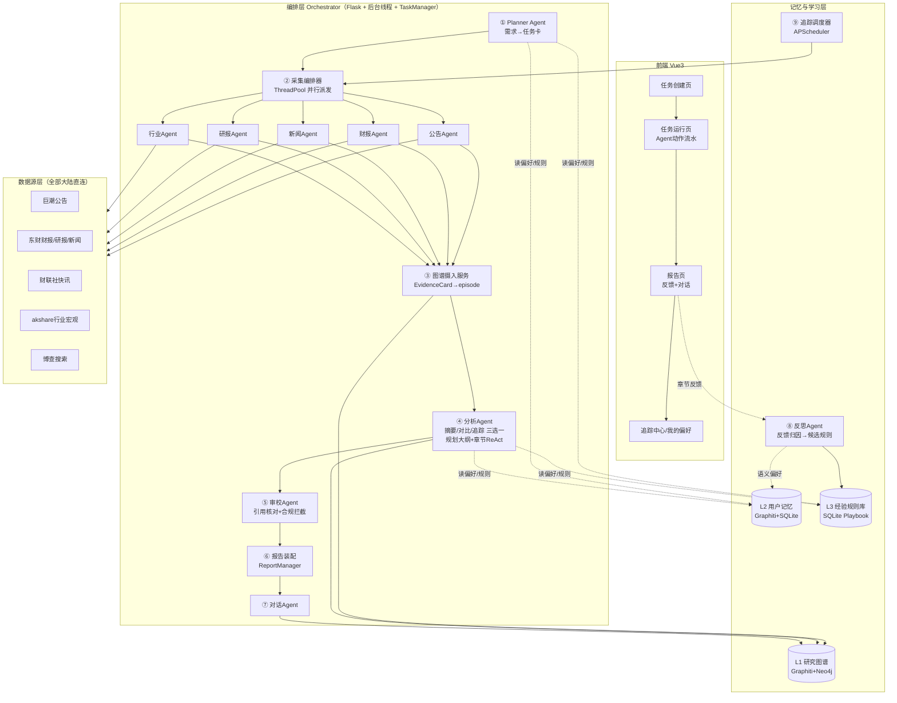

# 02 · 多 Agent 编排架构设计

> 本文档是全项目的总设计图。执行 Agent 必须先通读本文档再开工。
> 设计原则：**最大化继承 MiroFish 的工程骨架**（异步任务+轮询、文本协议 ReAct、图谱记忆、JSONL 过程日志），**整段替换**与投研场景错位的 OASIS 社媒仿真链路，**新增**历史学习层。

---

## 1. MiroFish 编排的解剖结论（改造依据）

MiroFish 后端是 `Flask API + 内存 TaskManager + 后台线程/子进程 + 文件持久化 + 前端 2s 轮询` 的编排模型，管线为：

```
上传+本体(同步) → 图谱构建(异步线程,轮询Task) → 创建Simulation(同步)
→ Prepare人设/配置(异步线程,轮询) → OASIS子进程仿真(文件IPC+actions.jsonl监控)
→ ReportAgent报告(异步线程, 规划chat_json + 章节级文本协议ReAct) → 报告对话(同步简化ReAct)
```

其中真正的"多 Agent"有两层：**编排层 LLM Agent**（OntologyGenerator、ProfileGenerator、ConfigGenerator、ReportAgent——前三个是单轮 JSON 生成器，只有 ReportAgent 是完整 ReAct）和**仿真层 OASIS 社交 Agent 群**。

**对投研场景的判断**：
- 值得继承的精华：① 阶段化异步管线与状态轮询协议；② 时序图谱作为所有 Agent 的共享记忆总线；③ ReportAgent 的"规划大纲 → 每章节 ReAct 工具循环（强制最少 3 次取证、最多 5 次、Final Answer 终止）→ 装配"范式；④ `agent_log.jsonl` 全程留痕带来的过程可观测性；⑤ 工具以字典注册 + `<tool_call>` XML 文本协议解析（不依赖模型原生 function calling，换模型不换代码）。
- 主管线替换：OASIS 仿真全家桶不适合承担"信息整理"主流程——整理需要的是**对真实数据源的并行采集**，因此主管线把"成千上万个仿真 Agent"替换为"5 类专家采集 Agent"。但 OASIS 链路本身（profile 生成、子进程运行、interview IPC）**整体移植保留为"情景推演"支线**（10 文档）：信息整理完成后，以研究图谱为种子世界推演假设情景——这是研究员"如果发生 X 会怎样"的高阶工作，也是本产品区别于纯信息聚合工具的核心亮点。
- MiroFish 缺失、我们新增：任务卡确认的人机交互点、审校 Agent、历史学习层（反馈→反思→规则库）、追踪订阅调度。

## 2. 成竹 总体架构



## 3. 端到端管线（阶段定义，对齐 MiroFish 的衔接方式）

| # | 阶段 | 执行体 | 同步/异步 | 输入 | 输出 | MiroFish 对应物 |
|---|------|--------|----------|------|------|----------------|
| 0 | 需求解析 | Planner Agent（单轮 chat_json + 记忆注入） | 同步（<10s） | 自然语言需求、可选上传文件、用户记忆 | TaskCard（草案） | OntologyGenerator 的同步生成模式 |
| 0b | 任务卡确认 | 用户 | 人机交互 | TaskCard 草案 | TaskCard（确认版） | **新增**（MiroFish 无确认环节） |
| 1 | 并行采集 | 采集编排器 + 5 类采集 Agent | 异步线程，Task 轮询 | TaskCard | EvidenceCard 集合（落盘 JSONL） | 替换 OASIS Prepare+仿真 |
| 2 | 图谱摄入 | GraphIngest 服务（非 LLM Agent） | 异步（与采集流水线化：每个 Agent 完成即入图） | EvidenceCards | ResearchGraph 增量 | GraphBuilderService（Zep Batch → Graphiti episodes） |
| 3 | 分析生成 | 分析 Agent（摘要/对比/追踪，按 TaskCard.deliverable 选一） | 异步线程，章节级进度 | ResearchGraph + EvidenceCards + 大纲 | 章节 Markdown（带引用角标） | ReportAgent 规划+ReAct 骨架 |
| 4 | 审校 | Reviewer Agent | 异步（分析每完成一章即审一章，流水线） | 章节草稿 + 证据卡索引 | 审定章节 + 审校记录 | **新增** |
| 5 | 装配交付 | ReportAssembler | 异步收尾 | 审定章节 | full_report.md + 引用清单 + 免责声明 | ReportManager.assemble_full_report |
| 6 | 对话追问 | Chat Agent（简化 ReAct，最多 2 轮工具） | 同步请求-响应 | 用户消息 + 历史 | 回复 + 工具调用记录 | ReportAgent.chat |
| 7 | 反馈学习 | Reflection Agent | 事件触发 + 每日定时 | feedback + task_run + agent_log | Playbook 候选规则 + L2 偏好 | **新增** |
| 8 | 追踪重跑 | TrackingScheduler | 定时（APScheduler cron） | TrackingSub + 水位线 | 增量简报（走 1→5 缩减管线） | **新增** |
| 9 | 情景推演（可选支线） | ScenarioAgent + OASIS 仿真 + 推演报告 Agent | 异步（15-25 分钟重操作，独立轮询） | 研究图谱 + 用户假设 | 情景观察报告 + 可采访的模拟世界 | OASIS 全链路**移植重定向**（详见 10 文档） |

### 3.1 任务状态机（ResearchTask，持久化 JSON，模式沿用 MiroFish Project/Task 双层）

```
created → parsing → awaiting_confirm → collecting → ingesting
        → analyzing → reviewing → assembling → completed
任意阶段 → failed（含 error 信息）
collecting 允许部分失败 → 后续正常走完 → completed_partial（报告披露缺失项）
```

- **持久层**：`uploads/tasks/{task_id}/task.json`（对应 MiroFish `project.json`），进程重启可恢复终态；
- **进度层**：进程内 `TaskManager` 单例（直接复用 MiroFish `app/models/task.py`：pending/processing/completed/failed + progress 0-100 + progress_detail），前端 2s 轮询；
- **进度权重分配**：parsing 0-5%，collecting 5-45%（5 个 Agent 各占 8%，完成即累加），ingesting 45-60%，analyzing 60-88%（按章节均分），reviewing 88-96%，assembling 96-100%。

### 3.2 并行采集编排（替换 OASIS 的核心设计）

`backend/app/services/collect_orchestrator.py`：

1. 由 TaskCard 决定激活哪些采集 Agent（`info_types` 字段，见 03 文档）；对比类任务对每个 symbol 各派发一轮；
2. `ThreadPoolExecutor(max_workers=COLLECTOR_MAX_PARALLEL)` 并行执行；每个采集 Agent 是"**LLM 制定采集计划（单轮 JSON）→ 顺序执行工具 → LLM 质检筛选**"的三步结构（详见 03 文档），不做长 ReAct（采集动作可预先规划，省 token 且稳定）；
3. 派发前查询 L3 routing 规则与数据源健康度（04 文档 §5），决定首选/降级工具；
4. 每个 Agent 完成即：EvidenceCards 落盘 `uploads/tasks/{id}/evidence/{agent}.jsonl` → 触发 GraphIngest 入图（流水线化，不等全部采集完）→ TaskManager 进度+8%；
5. 单 Agent 超时 180s / 抛异常：记 `collect_failures`，不阻塞其他 Agent；全部失败才置任务 failed；
6. 所有动作写 `agent_log.jsonl`（格式完全沿用 MiroFish ReportLogger 的 action/stage/details 结构，前端复用增量拉取协议）。

### 3.3 分析与审校的流水线

- 分析 Agent 先跑 `plan_outline`（继承 MiroFish：chat_json、temperature 0.3、大纲 2-5 章、失败有默认大纲兜底），大纲模板按 deliverable 类型给出固定骨架（01 文档 §6），LLM 只做小节增删与措辞；
- 每章节 ReAct 循环参数（沿用 MiroFish 经过验证的数值，但接到 env）：`min_tool_calls=2`、`max_tool_calls=ANALYST_MAX_TOOL_CALLS(6)`、`max_iterations=8`、冲突重试 2 次；工具协议原样保留 `<tool_call>{json}</tool_call>` + `Final Answer:`，解析器直接移植 MiroFish `_parse_tool_calls / _strip_fake_tool_results / _is_valid_tool_call`；
- 章节完成 → 立即送 Reviewer（独立线程队列），Reviewer 通过则落盘 `section_XX.md`，不通过则带批注退回分析 Agent 重写（最多 REVIEWER_MAX_ROUNDS=2 轮，仍不过则采纳 Reviewer 的改写稿并在审校记录中标注）；
- 全章节审定后装配：目录 + 正文 + 「信息来源清单」（全部 EvidenceCard 按角标编号列出）+ 「数据完整性说明」（collect_failures）+ 免责声明。

### 3.4 追踪订阅管线（闭环 B）

- APScheduler（BackgroundScheduler，随 Flask 启动）按订阅 cron 触发；
- 重跑时 TaskCard 不变，采集时间窗 = [上次水位线, now]；GraphIngest 增量写入（05 文档 §2.3）；
- 分析 Agent 使用"追踪简报"大纲，核心工具是图谱时序查询：新增边（created_at 在窗口内）→"本期新增"；失效边（invalid_at 在窗口内）→"变化与更正"；
- 简报存 `uploads/subscriptions/{sub_id}/briefs/{date}.md`，前端追踪中心时间线展示。

## 4. 关键技术决策记录（ADR）

| 决策 | 选择 | 理由（含放弃项） |
|------|------|-----------------|
| 工具调用协议 | 沿用 MiroFish 文本协议（XML tool_call） | 已验证可用、不依赖 qwen function calling 的稳定性、日志可读；放弃 OpenAI tools 原生协议 |
| 采集 Agent 结构 | 计划→执行→质检 三步，非 ReAct | 采集步骤可预先确定，ReAct 在此只增加成本与不确定性 |
| 并行机制 | 主管线用 ThreadPoolExecutor 线程池；推演支线保留 MiroFish 子进程+文件 IPC | 采集是 IO 密集用线程即可；OASIS 仿真是长驻环境，沿用其成熟的子进程+IPC 模式 |
| 图谱引擎 | 自托管 Graphiti+Neo4j | Zep Cloud 境外+闭源计费；Graphiti 是其开源内核，API 语义对齐，迁移成本最低（05 文档有对照表） |
| 前后端通信 | 保持轮询（2s Task / 增量 agent-log） | 复用 MiroFish 全部前端骨架；放弃 WebSocket（改造成本高，Demo 无必要） |
| 业务数据 | SQLite | 反馈/规则/健康度需要 SQL 聚合查询，MiroFish 纯 JSON 文件不够用；任务主档仍用 JSON 文件保持与 MiroFish 骨架一致 |
| 分析模型分级 | 采集/规划用 qwen-plus，章节生成与审校用 qwen-max | 质量敏感环节升配，成本敏感环节降配 |

## 5. 后端目录结构（执行 Agent 按此建目录）

```
backend/
  run.py
  app/
    __init__.py            # Flask 工厂，注册蓝图：task/report/feedback/memory/tracking/scenario
    config.py              # 沿用 MiroFish 模式，环境变量见 README
    constants.py           # DISCLAIMER 等固定文案
    api/
      task.py              # 任务创建/确认/状态/证据卡
      report.py            # 报告获取/agent-log/对话
      feedback.py          # 章节反馈/报告评分
      memory.py            # 偏好读取/删除/预填/playbook stats
      tracking.py          # 订阅 CRUD/简报列表
    models/
      task_card.py         # TaskCard dataclass + 校验
      research_task.py     # ResearchTask 状态机 + JSON 持久化（仿 project.py）
      task.py              # ← 直接拷贝 MiroFish app/models/task.py
    services/
      planner.py           # ① Planner Agent
      collect_orchestrator.py  # ② 采集编排器
      collectors/          # 5 个采集 Agent（共享基类 base_collector.py）
      graph_ingest.py      # ③ EvidenceCard → Graphiti episode
      analyst.py           # ④ 分析 Agent（含 plan_outline + ReAct 循环，移植 report_agent.py 骨架）
      reviewer.py          # ⑤ 审校 Agent + compliance_checker.py
      report_assembler.py  # ⑥ 装配（移植 ReportManager）
      chat_agent.py        # ⑦ 对话
      reflection.py        # ⑧ 反思 Agent
      tracking_scheduler.py# ⑨ 追踪调度
      scenario/            # ⑩ 情景推演模块（10 文档）：scenario_agent.py, personas.py,
                           #    profile_generator.py, config_generator.py, runner.py,
                           #    ipc.py, scenario_report.py（移植自 MiroFish simulation_* 链路）
      playbook.py          # 规则库读写与状态机
      source_health.py     # 数据源健康度
      agent_logger.py      # ← 移植 MiroFish ReportLogger（泛化 report_id→task_id）
    tools/                 # 见 04 文档（registry/schema/rate_limiter/symbol + 10 个工具模块）
    graphdef/              # entities.py / edges.py（投研本体 Pydantic）
    utils/                 # ← 直接拷贝 MiroFish: llm_client.py, openai_chat_compat.py,
                           #    retry.py, logger.py, file_parser.py；新增 graph_client.py, db.py
  uploads/                 # tasks/ subscriptions/ cache/ chengzhu.db
```

## 6. MiroFish → 成竹 逐文件继承对照表（执行 Agent 施工地图）

| MiroFish 文件 | 处置 | 成竹 去向与改动 |
|---------------|------|----------------------|
| `utils/llm_client.py` `openai_chat_compat.py` `retry.py` `logger.py` `file_parser.py` | **原样拷贝** | utils/ 同名；llm_client 增加按用途选模型（plus/max） |
| `models/task.py`（TaskManager） | **原样拷贝** | models/task.py |
| `models/project.py` | 改写 | models/research_task.py：状态机换为 §3.1，保留 JSON 落盘/恢复模式 |
| `services/report_agent.py` | **重点移植** | analyst.py：保留 ReportLogger→agent_logger.py、大纲规划、ReAct 循环、工具解析器、装配器；替换全部 Prompt（03 文档）与工具集；`interview_agents` 删除，新增 `read_announcement`/数据工具 |
| `services/zep_tools.py` | 移植换底 | utils/graph_client.py + tools/graph_*.py：quick_search/panorama/insight_forge 三件套逻辑保留，底层 zep-cloud SDK → graphiti-core（05 文档对照表） |
| `services/graph_builder.py` | 移植换底 | graph_ingest.py：Batch 摄入→逐 episode 写入（Graphiti 无 Batch API），保留进度回调与对账思想 |
| `services/text_processor.py` | 原样拷贝 | 用户上传材料切块（F9） |
| `services/ontology_generator.py` | 替换 | graphdef/：社媒本体 Prompt 废弃，投研本体为固定 Pydantic 定义（05 文档 §2.2），不再需要 LLM 生成本体 |
| `services/oasis_profile_generator.py` `simulation_config_generator.py` `simulation_runner.py` `simulation_ipc.py` `scripts/run_*.py` | **移植保留**（场景重定向） | services/scenario/ 与 backend/scenario_scripts/：人设改为 7 类市场角色模板、时间轴改交易时段、默认单平台；Zep 调用换 graph_client（10 文档 §2） |
| `services/zep_entity_reader.py` `zep_graph_memory_updater.py` | 移植换底 | scenario/ 内部：实体读取与仿真记忆回写走 graphiti，写独立 `scenario_{id}` 图谱 |
| `utils/zep.py` `zep_paging.py` `zep_lifecycle.py` `ontology.py` | 删除 | Graphiti 直连 Neo4j，无需 Cloud 分页/生命周期锁；本体校验由 Pydantic 承担 |
| `api/graph.py` `simulation.py` `report.py` | 重写 | api/ 五个蓝图；**保留** task_id 轮询协议、agent-log 增量拉取协议（from_line 参数）的接口形态，前端少改 |
| frontend 整体（Vue3+Vite+D3, 无UI库, 2s轮询） | 骨架保留 | 页面重排见 07 文档；GraphPanel(D3) 原样复用；Step 组件替换为新管线阶段 |
| `docker-compose.yml` | 扩展 | 增加 neo4j:5.26 服务与卷 |

## 7. 一次典型任务的完整时序（供联调与测试对照）

```
用户提交需求 → POST /api/task/create
  Planner(qwen-plus, 1次调用, 注入L2偏好+L3规则) → task.json[awaiting_confirm] → 返回TaskCard
用户确认 → POST /api/task/{id}/confirm → 状态collecting，启动后台线程
  采集编排器：查健康度 → 并行派发5个采集Agent
    每个Agent: 计划(1次LLM) → 执行工具2-6次 → 质检(1次LLM) → evidence落盘 → 入图 → 进度+8%
  全部就绪 → analyzing
  分析Agent: plan_outline(1次) → 每章节ReAct(2-6次工具+2-8次LLM) → 章节完成即送审
  Reviewer: 每章1-2次LLM(引用核对+合规) → 通过/退回
  装配 → completed → task.json 终态落盘, task_run 写库
前端全程: GET /api/task/{id}/status (2s) + GET /api/task/{id}/agent-log?from_line=N (2s)
用户反馈 → POST /api/feedback → 触发 Reflection(1次LLM) → playbook候选规则 + L2偏好episode
```

预算核对（01 文档非功能需求）：单摘要任务 LLM 调用约 5(采集计划+质检×5... 实际 10) + 1(规划) + 24(4章×6) + 8(审校) + 1(反思) ≈ 45 次，qwen-plus/max 混合下约 ¥1-1.5，达标。
